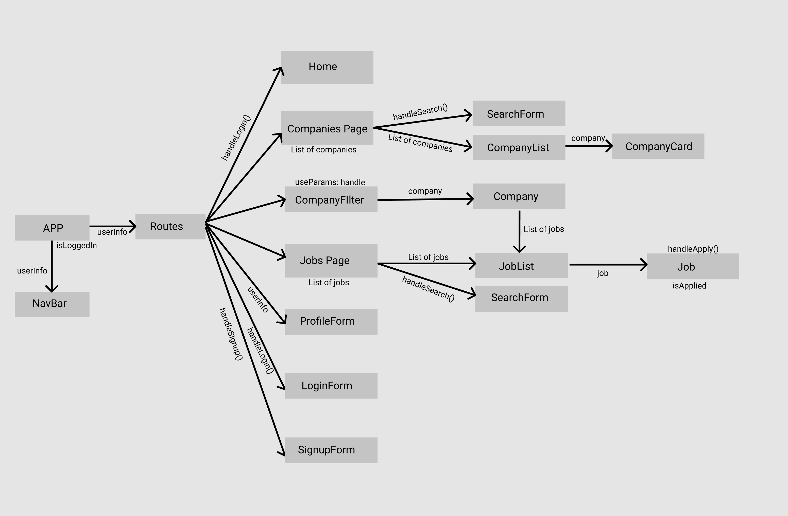

# Jobly

Jobly is a fullstack joblisting application where users can search for and apply to job openings. Jobly includes technologies such as React components for frontend and an RESTful Express.js backend. For ease of deployment, the backend repository has been separated and can be found [here](https://github.com/lancelee2885/react-jobly/tree/main/jobly-backend).

Authentication of this app is achieved with Bcrypt and JSON Web Tokens. Once logged in, users have access to the following features: 
- search for companies by their names
- view company details with associated job listings
- search for job listings by position name
- view applied jobs
- view and edit user profile

You can view the deployed version of Jobly [here](http://jobly-lance.surge.sh/).

 

## React Component Hierarchy

 

## Setup Instructions

1. Clone and install the backend repository [here](https://github.com/lancelee2885/react-jobly/tree/main/jobly-backend)
2. Navigate into Jobly frontend directory `cd jobly-frontend`
3. Install dependencies `npm install`
4. Start the React App `npm start`

 

## Technologies Used

- [React](https://reactjs.org/) - Javascript frontend framework
- [Node.js](https://nodejs.org/en/) - Javascript backend environment
- [Express](https://expressjs.com/) - Node.js backend framework
- [PostgreSQL](https://www.postgresql.org/) - Relational database system

 

## Authors 

Jobly is authored by [Lance Lee](https://github.com/lancelee2885) and [Grant Li](https://github.com/grantli).

 

## Acknowledgements

While we built both the frontend and backend for this application individually, the frontend is deployed using a version of the backend built by Rithm School. This was provided to ensure all student pairs were working with a consistent backend. 